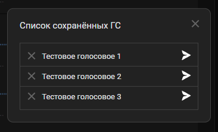
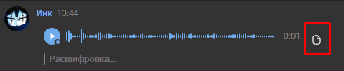
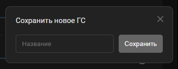

# Voice Stealer

Сохранение и отправление чужих голосовых сообщений в VK от своего имени.

## Навигация
* [Функционал](#Функционал)
* [Установка](#Установка)
  * [GitHub](#GitHub)
  * [GreasyFork](#GreasyFork)
* [Использование](#Использование)

## Функционал
1) Операции над голосовыми сообщениями:
- [x] Добавление
- [x] Удаление
- [ ] Редактирование
- [ ] Поиск
- [ ] Добавление с ПК

2) Сохранение голосовых из следующих сообщений:
- [x] Обычных
- [ ] Пересланных
- [ ] Ответов

3) Сохранение голосовых в:
- [x] Беседах
- [x] Личных сообщениях

## Установка
Для работы скрипта нужно установить расширение [Tampermonkey](https://www.tampermonkey.net/).

### GitHub
1. Копируем содержимое файла [voice.stealer.js](https://github.com/FallenAstaroth/vk-scripts/blob/master/VoiceStealer/voice.stealer.js).
2. Нажимаем на иконку Tampermonkey в меню с расширениями.
3. Нажимаем `Create a new script`.
4. Вставляем код из файла [voice.stealer.js](https://github.com/FallenAstaroth/vk-scripts/blob/master/VoiceStealer/voice.stealer.js).
5. Сохраняем и перезагружаем страницу с VK.

### GreasyFork
1. Открываем [страницу со скриптом](https://greasyfork.org/ru/scripts/457142-voice-stealer).
2. Нажимаем `Установить`.
3. Подтверждаем и перезагружаем страницу с VK.

## Использование
1. Кнопка вызова меню с сохраненными голосовыми:

2. Меню с сохраненными голосовыми:

3. Кнопка сохранения голосового:

4. Окно сохранения голосового:

